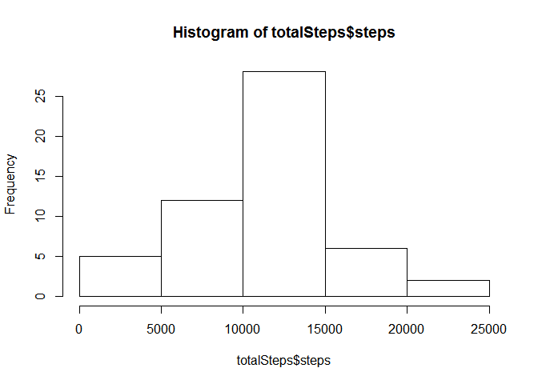
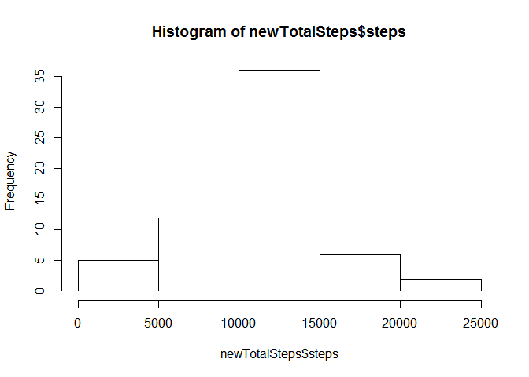
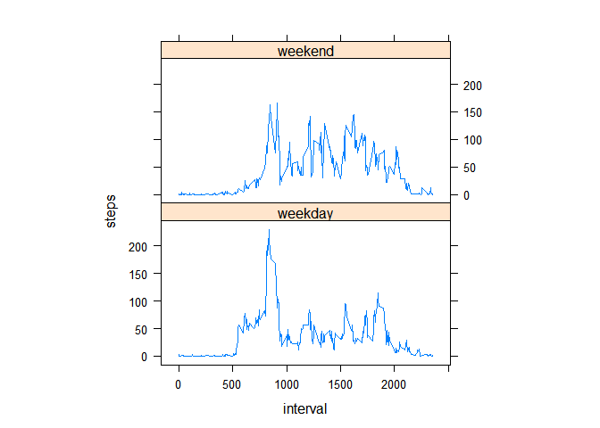

# Reproducible Research: Peer Assessment 1

### Load and preprocess the data 

```r
activity <- read.csv("activity.csv")
```

**What is mean total number of steps taken per day? **

```r
totalSteps <- aggregate(steps ~ date, data = activity, sum, na.rm = TRUE)
```

**Make a histogram of the total number of steps taken each day **

```r
hist(totalSteps$steps)
```

 

**Calculate and report the mean and median of the total number of steps taken per day **

```r
meanSteps <- mean(totalSteps$steps)
medianSteps <- median(totalSteps$steps)
meanSteps
```

```
## [1] 10766.19
```

```r
medianSteps
```

```
## [1] 10765
```

Mean total number of steps taken per day is: 1.0766189\times 10^{4}  The median total number of steps taken per day is: 10765


### Average daily activity pattern?
**Make a time series plot (i.e. type = "l") of the 5-minute interval (x-axis) and the average number of steps taken, averaged across all days (y-axis) **

```r
meanIntervalSteps <- aggregate(steps ~ interval, data = activity, mean, na.rm = TRUE)
plot(steps ~ interval, data = meanIntervalSteps, type = "l")
```

 

**Which 5-minute interval, on average across all the days in the dataset, contains the maximum number of steps? **

```r
maxSteps <- meanIntervalSteps[which.max(meanIntervalSteps$steps), ]$interval
maxSteps
```

```
## [1] 835
```

The 835 5-minute interval contains the maximum number of steps.

## Inputing missing values
**Calculate and report the total number of missing values in the dataset (i.e. the total number of rows with NAs) **

```r
naValues <- sum(is.na(activity$steps))
naValues
```

```
## [1] 2304
```

There are 2304 missing values in the dataset

**Devise a strategy for filling in all of the missing values in the dataset. Create a new dataset that is equal to the original dataset but with the missing data filled in Using mean for 5-minute intervals, averaged across all days **

```r
newActivity <- activity
for (i in 1:nrow(newActivity)) {
  if (is.na(newActivity[i, ]$steps)) {
    newActivity[i, ]$steps <- meanIntervalSteps[newActivity[i, ]$interval == meanIntervalSteps$interval, ]$steps
  }
}
```

**Make a histogram of the total number of steps taken each day and Calculate and report the mean and median total number of steps taken per day. Do these values differ from the estimates from the first part of the assignment? What is the impact of inputing missing data on the estimates of the total daily number of steps? **

```r
newTotalSteps <- aggregate(steps ~ date, data = newActivity, sum)
hist(newTotalSteps$steps)
```

 

```r
newMeanSteps <- mean(newTotalSteps$steps)
newMedianSteps <- median(newTotalSteps$steps)
newMeanSteps
```

```
## [1] 10766.19
```

```r
newMedianSteps
```

```
## [1] 10766.19
```

## Differences in activity patterns between weekdays and weekends
**Create a new factor variable in the dataset with two levels -- "weekday" and "weekend" indicating whether a given date is a weekday or weekend day **

```r
newActivity$day = ifelse(as.POSIXlt(as.Date(newActivity$date))$wday%%6 == 0, "weekend", "weekday")
```

**Make a panel plot containing a time series plot (i.e. type = "l") of the 5-minute interval (x-axis) and the average number of steps taken, averaged across all weekday days or weekend days (y-axis) **

```r
library (lattice)
newStepsInterval = aggregate(steps ~ interval + day, newActivity, mean)
xyplot(steps ~ interval | factor(day), data = newStepsInterval, aspect = 1/2, layout = c(1, 2), type = "l")
```

 
